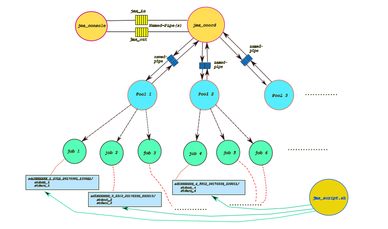

# Job Management System

## About

This is the second assignment of "Unix Systems Programming" course (spring 2017).

The main goal of this assignment is to create a *job management system* , which will handle a handful of jobs (i.e: unix commands or user programs) submitted by the user.

Jobs will be processed by a hierarchy of processes created dynamically using *exec()* and *fork()* system calls. Those processes will be able to communicate via named pipes and signals.

## Implementation

The application consists of three main parts :

  * **jms_console**   : Provides an interface for the user to submit the jobs and various queries (i.e: operations) regarding the status of the service.

  * **jms_coord**     : It is responsible for coordinating the jobs. Creates *pool* processes which will take care of the execution of the jobs.

  * **pool**          : Each pool handles the execution of all the jobs assigned to it. Pool program acts as a supervisor for its jobs. In addition, it returns statistics back to the coordinator upon finishing.

  * **jms_script.sh script** : Simple shell script which can be used to present or purge the  output directories. Each job creates a directory which contains its standard output as well as the standard error content . 

  *Image below illustrates how the job service works*

  

## Operations

Operations file will contain operations of the following types :

  * `submit <job>`

    Feeds *coordinator* with the job to be executed. *Coordinator* will then assign the job to the first available *pool* which will then be responsible for its execution.

    Job's unique id and Linux process id (pid) assigned to it are returned.

  * `status <JobID>`

    Fetches the status of the job with id equal to `<JobID>`.

    Status can have the following values:
    1. Running
    2. Finished
    3. Suspended

  * `status-all [time-duration]`

    Fetches the status of every job. `time-duration` is an optional parameter which defines how many seconds that may have passed since the job was fed to the system.

  * `show-active`

    Searches for all active jobs and outputs their ids.

  * `show-finished`

    Searches for all finished jobs and outputs their ids.

  * `show-pools`

    Seaches for all pool processes currently running. Linux process id (pid) as well as the number of jobs assigned to each pool are shown on the output.

  * `suspend <JobID>`

    Supsends the execution of the job with id equal to `<JobID>`.

  * `resume <JobID>`

    Resumes the execution of the job with id equal to `<JobID>`.

  * `shutdown`

    Terminates the job management service by executing the following steps:

    1. *Coordinator* process sends SIGTERM signal to every running *pool* process.

    2. Each *pool* handles the signal by fowarding it to every job it supervises.

    3. *Pool* exits returning the number of jobs still in progress

    4. *Coordinator* terminates as soon as all pools have exited.

## Usage

* `make`

* `cd build`

* `./jms_coord -l <path> -n <jobs-pool> -w <jms-out> -r <jms-in> &`

  * `path`: directory name under which the output directories will be stored

  * `jobs-pool`: maximum number of jobs assigned to each pool

  * `jms-in`: name of the pipe used for reading operations sent by the consolse

  * `jms-out`: name of the pipe used for writing the response back to the console 

* `./jms_console -w <jms-in> -r <jms-out> -o <operations-file>`

  * `jms_in`: name of the pipe used for feeding coordinator with operations

  * `jms_out`: name of the pipe used for reading coordinator's response

  * `operations-file`: name of the input file which will contain a list of [operations](#Operations) 

### Running the script:

`./jms_script.sh  -l <path> -c <command>`

  * `path`: directory name under which the output files/directories will be stored

  * `command`: can be one of the following:

    1. `list`: presents a list of the output directories produced by the jobs

    2. `size [n]`: presents a list of the output directories sorted by size in ascending order. Optional argument `n`  limits the output to the n largest directories

    3. `purge`: deletes all existing directories outputed by the jobs 

  Modify makefile constants to match your needs (e.g: pipe names, output directory e.t.c)
